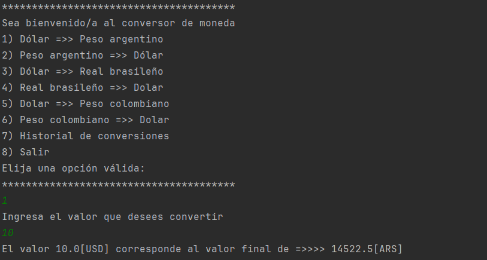
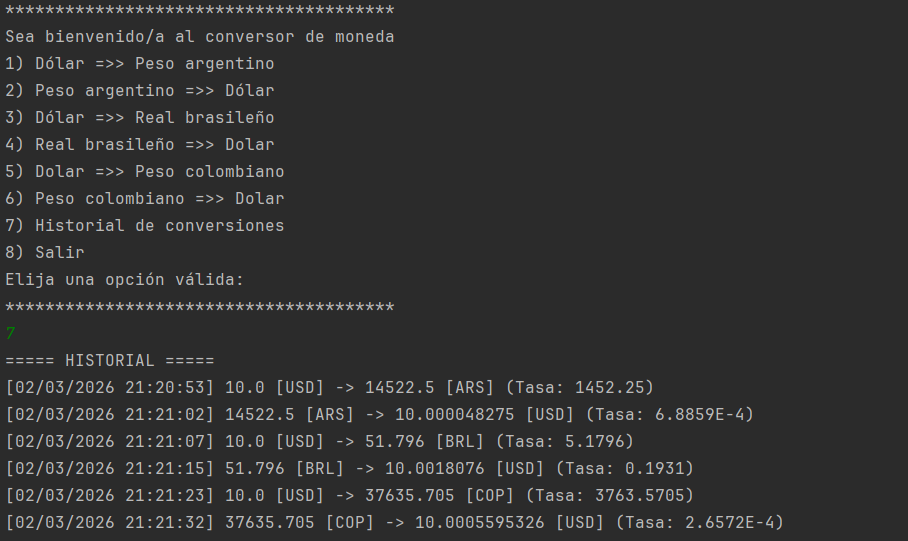
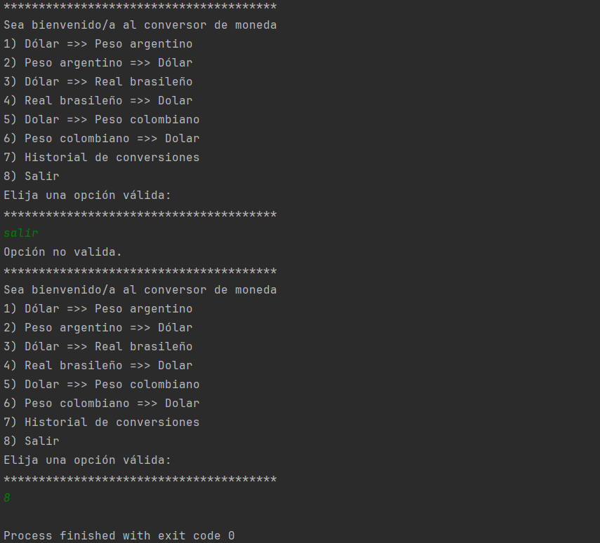

# challenge-conversor-de-moneda-en-Java

Aplicación de consola desarrollada en **Java** que permite convertir monedas en tiempo real utilizando una API externa(ExchangeRate).  
El sistema registra un historial de conversiones incluyendo fecha y hora de cada operación.

---

##  Vista del Programa


###  Ejemplo de conversión


###  Historial de conversiones


###  Ejemplo opcion incorrecta



---

##  Descripción

Este proyecto fue desarrollado con el objetivo de practicar:

- Consumo de APIs REST  
- Manejo de JSON  
- Programación Orientada a Objetos (POO)  
- Uso de colecciones (`ArrayList`)  
- Manejo moderno de fechas con `java.time`  

El programa permite convertir distintas monedas y consultar un historial detallado de todas las conversiones realizadas durante la ejecución.

---

##  Características

- Conversión en tiempo real entre:

  - USD ↔ ARS  
  - USD ↔ BRL  
  - USD ↔ COP  

- Consumo de API externa  
- Parseo de JSON con Gson  
- Registro automático de fecha y hora  
- Historial de conversiones en memoria  
- Estructura modular basada en clases  

---

##  Tecnologías utilizadas

- Java 17+
- `java.net.http.HttpClient`
- Gson
- `java.time` (LocalDateTime, DateTimeFormatter)
- API REST de tasas de cambio

---

##  Cómo ejecutar el proyecto

```bash
git clone https://github.com/jcesarcorrea/conversor-monedas.git
cd conversor-monedas
```

1. Abrir el proyecto en tu IDE (IntelliJ, Eclipse, VS Code, etc.)  
2. Agregar tu API Key en la clase `ConsultaApi`  
3. Ejecutar la clase `Principal`  

---

